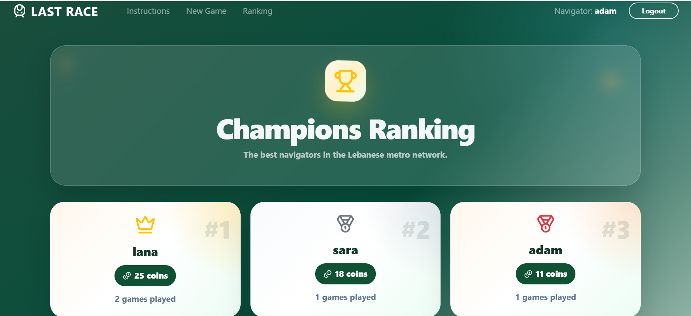
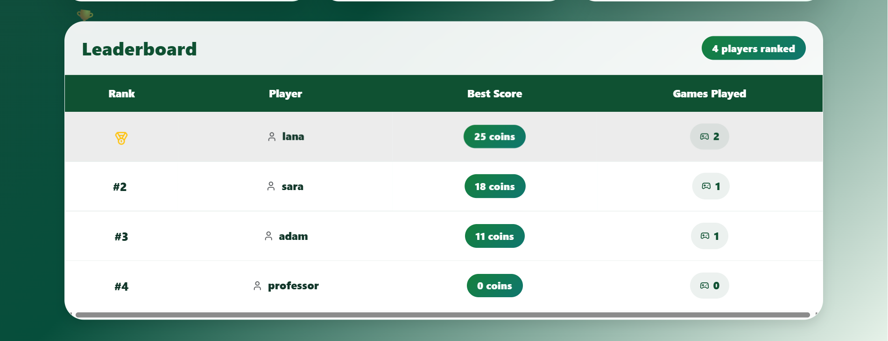
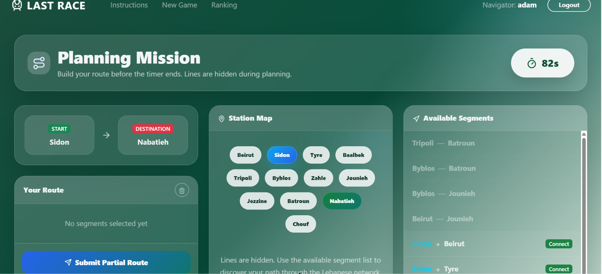
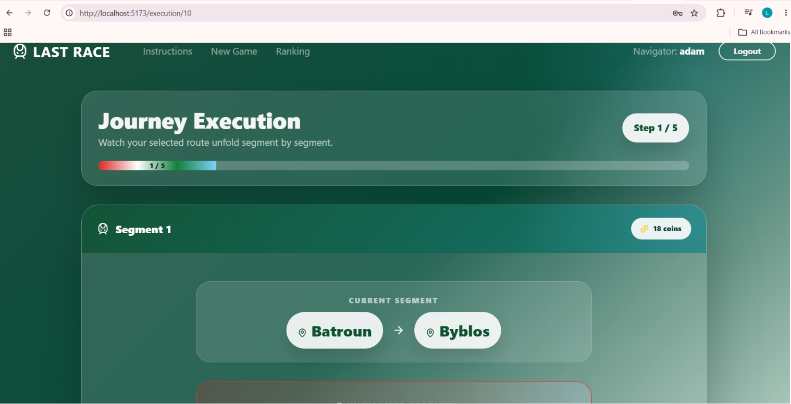
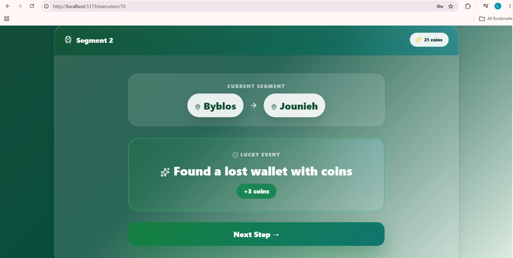

# Exam #1: "Last Race"

## Student: Lana Saab

## ID: 353144

## 1. Server-side

### HTTP APIs

#### Sessions

* `POST /api/sessions`
  Request body: `{ username, password }`
  Response: authenticated user `{ id, username }`.

* `GET /api/sessions/current`
  Response: current logged-in user `{ id, username }`, or `401` if not authenticated.

* `DELETE /api/sessions/current`
  Logs out the current user and destroys the session.

#### Network

All network APIs require authentication.

* `GET /api/network`
  Response: full network as lines, each containing ordered stations.

* `GET /api/network/stations`
  Response: list of all stations.

* `GET /api/network/segments`
  Response: list of all connected station pairs.

#### Games

All game APIs require authentication.

* `POST /api/games`
  Starts a new game. The server randomly assigns a start and destination station with minimum distance of 3 segments.
  Response: created game information.

* `GET /api/games/:id`
  Parameter: `id` = game id.
  Response: game status, start station, destination station, final score, and steps if the game is completed or failed.

* `POST /api/games/:id/submit`
  Parameter: `id` = game id.
  Request body: `{ route: [{ fromId, toId }, ...] }`
  Response: final status, final score, and generated journey steps.

#### Rankings

* `GET /api/rankings`
  Response: global leaderboard with username, best score, and completed games count.

### Database Tables

* `users`: Stores registered users with username, salted hash, and salt.
* `stations`: Stores station/city data, including name, Arabic title, and landmark.
* `lines`: Stores metro lines with name and color.
* `line_stations`: Associates stations to lines and stores their position/order.
* `segments`: Stores bidirectional physical connections between stations.
* `events`: Stores random events with description and coin effect.
* `games`: Stores each game instance, including user, start, destination, status, and final score.
* `game_steps`: Stores the detailed execution history of each completed game.

## 2. Client-side

### React Routes

* `/`: Home landing page introducing the game.
* `/instructions`: Public instructions page explaining the game rules.
* `/login`: Login page for registered users.
* `/setup`: Phase 1, where the user studies the full network map.
* `/planning/:gameId`: Phase 2, where the user builds a route within 90 seconds.
* `/execution/:gameId`: Phase 3, where the journey is displayed step by step with random events.
* `/result/:gameId`: Phase 4, where the final score is displayed.
* `/journey/:gameId`: Shows the selected route with city/landmark information.
* `/ranking`: Shows the global leaderboard.

### Main React Components

* `AuthContext`: Manages global authentication state and session checking.
* `ProtectedRoute`: Protects private routes from anonymous users.
* `Navbar`: Provides navigation and login/logout display.
* `Home`: Landing page with the game introduction.
* `Instructions`: Explains the rules and phases of the game.
* `Login`: Handles user authentication.
* `Setup`: Shows the full network and starts a new game.
* `Planning`: Handles route construction, timer, and submission.
* `Execution`: Displays the generated journey steps one by one.
* `Result`: Displays the final score and navigation options.
* `Journey`: Displays the route history with Lebanese city information.
* `Ranking`: Displays the leaderboard.

### Additional Components
* `Hero Section`
* `ArrivalExperience`
* `Network Visualization Components`

## 3. Overall

### Screenshots

* Ranking Page: 
* Ranking Page: 
* Game Planning Page: 
* Game Execution Page: 
* Game Execution Page: 

-> After the user submits a valid route, the route is executed segment by segment. For each segment, the backend selects a random event from the events table. The event modifies the player's coins by a value between -4 and +4. The updated coin count is stored in game_steps and displayed in the execution page. After the last segment, the final score is computed and stored in the games table.

### User Credentials

* Username: `lana` — Password: `password`
* Username: `sara` — Password: `password`
* Username: `adam` — Password: `password`
* Username: `professor` - password: `password` -> created by addUser.js

### Use of AI Tools

I used AI tools to clarify concepts, review code structure, improve styling ideas (specifically the homepage), and identify possible optimizations. All generated suggestions were manually checked, adapted, and tested against the project requirements, especially authentication, route validation, database constraints, and the game rules.

### Notes

* The current implementation is fully suitable for the project size and requirements.

* Potential future optimizations include:

- Replacing BFS queue.shift() with a queue index to preserve O(V+E) complexity.
- Caching the network topology in memory because the metro network is static.
- Using Maps/Sets to reduce repeated searches during route validation.
- Wrapping game-step insertions in database transactions.
- Adding database indexes on frequently queried columns such as:
  -games.user_id
  -games.status
  -game_steps.game_id
  -segments.station_a_id
  -segments.station_b_id